# Firestore Index Error - Complete Solution

## ✅ Problem Fixed

The referral system was throwing the following error:

```
Snapshot listener error: FirebaseError: The query requires an index. You can create it here: https://console.firebase.google.com/v1/r/project/cursor-64188/firestore/indexes?create_composite=...
```

## 🔧 Solution Implemented

### 1. Enhanced Error Handling in Service Layer

**File:** `client/lib/enhancedReferralService.ts`

- **Improved subscription setup**: Added try-catch around query setup to handle index errors immediately
- **Fallback subscription mechanism**: Created `subscribeToUserReferralsFallback()` that uses basic queries without composite indexes
- **Graceful degradation**: System continues to work with basic functionality while index is being created
- **Centralized error handling**: Added `handleIndexError()` function for consistent error management

**Key improvements:**
```typescript
// Before: Index error would crash the subscription
const referralsQuery = query(
  collection(db, 'referrals'),
  where('referrerUserId', '==', userId),
  orderBy('createdAtMs', 'desc'), // ❌ Requires composite index
  limit(50)
);

// After: Fallback to basic query if index not ready
try {
  // Try optimized query first
  const optimizedQuery = query(/* with orderBy */);
  return onSnapshot(optimizedQuery, callback);
} catch (setupError) {
  // Use fallback without composite index
  const basicQuery = query(
    collection(db, 'referrals'),
    where('referrerUserId', '==', userId), // ✅ Works without index
    limit(50)
  );
  // Sort in memory instead
  return onSnapshot(basicQuery, (snapshot) => {
    const sorted = snapshot.docs
      .map(doc => ({ id: doc.id, ...doc.data() }))
      .sort((a, b) => (b.createdAtMs || 0) - (a.createdAtMs || 0));
    callback(sorted);
  });
}
```

### 2. Enhanced UI Error Component

**File:** `client/components/ReferralIndexError.tsx`

- **Automatic retry mechanism**: Tries to reconnect 3 times with exponential backoff (10s, 20s, 30s)
- **Real-time countdown**: Shows time until next auto-retry
- **Loading states**: Visual feedback during retry attempts
- **Manual retry option**: Users can force retry at any time

**New features:**
- ⏰ Auto-retry with countdown timer
- 🔄 Manual retry button with loading state
- 📊 Retry attempt counter (1/3, 2/3, 3/3)
- 💡 Helpful hints after multiple failed attempts

### 3. Improved Dashboard Integration

**File:** `client/components/ReferralDashboard.tsx`

- **Index error callback**: Properly handles index errors from service layer
- **Error state management**: Shows appropriate UI when index is missing
- **Seamless recovery**: Automatically switches back to normal view when index becomes available

## 🚀 User Experience Improvements

### Before (❌ Broken Experience)
1. User visits referrals page
2. Console shows cryptic Firestore error
3. Page shows empty state or loading forever
4. User has no idea what to do

### After (✅ Smooth Experience)
1. User visits referrals page
2. System detects missing index
3. Shows friendly explanation with direct link to fix
4. Automatically retries every 10-30 seconds
5. User can manually retry or just wait
6. Page automatically works once index is ready

## 🔗 Index Creation Process

### Automatic (Recommended)
1. Click the provided link in the error message
2. Firebase Console opens with pre-filled index configuration
3. Click "Create Index"
4. Wait 1-2 minutes for creation
5. Page automatically detects when ready

### Manual
1. Go to [Firebase Console](https://console.firebase.google.com)
2. Navigate to Firestore → Indexes
3. Click "Create Index"
4. Configure:
   - **Collection ID:** `referrals`
   - **Field 1:** `referrerUserId` (Ascending)
   - **Field 2:** `createdAtMs` (Descending)
5. Click "Create"

## 🏗️ Technical Details

### Required Index Configuration
```javascript
{
  "collectionGroup": "referrals",
  "queryScope": "COLLECTION",
  "fields": [
    {
      "fieldPath": "referrerUserId",
      "order": "ASCENDING"
    },
    {
      "fieldPath": "createdAtMs",
      "order": "DESCENDING"
    }
  ]
}
```

### Fallback Query Strategy
When composite index is not available:
1. **Primary query:** `where('referrerUserId', '==', userId).orderBy('createdAtMs', 'desc')` ❌
2. **Fallback query:** `where('referrerUserId', '==', userId)` ✅
3. **In-memory sorting:** Sort results by `createdAtMs` in JavaScript
4. **Performance impact:** Minimal for typical datasets (<100 referrals per user)

## 🔄 Error Recovery Flow

```mermaid
graph TD
    A[User visits referrals page] --> B[Try optimized subscription]
    B --> C{Index ready?}
    C -->|Yes| D[✅ Normal operation]
    C -->|No| E[Use fallback subscription]
    E --> F[Show index creation UI]
    F --> G[Auto-retry every 10-30s]
    G --> H{Index ready?}
    H -->|Yes| I[✅ Switch to optimized]
    H -->|No| J[Continue with fallback]
    F --> K[User clicks create index]
    K --> L[Wait 1-2 minutes]
    L --> H
```



## 🎯 Key Benefits

1. **Zero downtime**: System continues working during index creation
2. **User-friendly**: Clear instructions and automatic recovery
3. **Developer-friendly**: Comprehensive error logging and debugging info
4. **Production-ready**: Handles edge cases and provides graceful degradation

## 🐛 Debugging

If issues persist:

1. **Check console logs** for detailed error messages
2. **Verify index status** in Firebase Console → Firestore → Indexes
3. **Try manual refresh** after index creation
4. **Check network connectivity** if auto-retry fails

## 📊 Monitoring

The solution includes comprehensive logging:

```typescript
// Service layer logs
console.warn('🚨 Firestore index required for referrals. Using fallback method...');
console.log('📡 Using fallback subscription for referrals (no composite index)');
console.log(`✅ Fallback successful: loaded ${referrals.length} referrals`);

// Error detection logs
console.error('Snapshot listener error:', error);
console.error('🚨 FIRESTORE INDEX REQUIRED 🚨');
```

This ensures easy debugging and monitoring in production environments.
