# Syllabus Index Error Fix - Complete

## ✅ **Problem Solved**

Fixed the Firestore index error for the `assistant_syllabus` collection:

```
Error in syllabus subscription: FirebaseError: The query requires an index.
```

The error was caused by a composite query requiring an index on:
- `assistantId` (Ascending)
- `status` (Ascending) 
- `createdAtMs` (Descending)

## 🔧 **Solution Implemented**

### 1. **Enhanced Service Layer** (`client/lib/syllabusService.ts`)

#### **Graceful Error Handling for Async Functions:**
- **getAssistantSyllabi()**: Added try-catch with fallback query
- **Fallback Strategy**: Use basic query without compound filtering, then filter/sort in memory
- **No Breaking Changes**: Functions return the same data structure

#### **Robust Subscription Management:**
- **subscribeToAssistantSyllabi()**: Enhanced with fallback subscription
- **Automatic Fallback**: Switches to basic query if composite index not available
- **Error Callback**: Optional parameter for UI error handling

#### **Memory-Based Filtering:**
```typescript
// Fallback approach when index is missing
const basicQuery = query(
  collection(db, "assistant_syllabus"),
  where("assistantId", "==", assistantId) // ✅ Works without index
);

// Filter and sort in JavaScript
const publishedSyllabi = allSyllabi
  .filter(syllabus => syllabus.status === 'published')
  .sort((a, b) => (b.createdAtMs || 0) - (a.createdAtMs || 0));
```

### 2. **Updated Components** (`client/components/admin/SyllabusManager.tsx`)

#### **Enhanced Error Handling:**
- Added error callback to handle index issues gracefully
- Maintains loading state management
- No visual disruption for users

#### **Seamless Fallback:**
```typescript
const unsubscribe = subscribeToAssistantSyllabi(
  assistantId, 
  (newSyllabi) => {
    setSyllabi(newSyllabi);
    setLoading(false);
  },
  () => {
    // Index error callback - graceful handling
    console.warn('⚠️ Syllabus index not ready, using fallback queries');
    setLoading(false);
  }
);
```

### 3. **Documentation** (`client/docs/firestore-indexes-syllabus.md`)

#### **Complete Index Setup Guide:**
- Direct link to create the required index
- Manual setup instructions
- CLI commands for automated deployment
- Security rules for the collection

#### **Troubleshooting Guide:**
- Error recovery steps
- Performance impact analysis
- Index propagation timing

## 🎯 **Key Improvements**

### **1. Zero Downtime** ✅
- System continues working during index creation
- Automatic fallback to functional queries
- No user-facing errors or broken functionality

### **2. Self-Healing** ✅
- Automatic detection of missing indexes
- Seamless transition between optimal and fallback queries
- Recovery when indexes become available

### **3. Developer-Friendly** ✅
- Clear console logging with direct fix links
- Comprehensive error messages
- Documentation for future maintenance

### **4. Performance Optimized** ✅
- Minimal impact when index is missing
- Efficient memory-based filtering for small datasets
- Optimal performance when index is available

## 📊 **Error Recovery Flow**

```mermaid
graph TD
    A[Subscribe to Syllabi] --> B[Try Composite Query]
    B --> C{Index Available?}
    C -->|Yes| D[✅ Normal Operation]
    C -->|No| E[Use Basic Query]
    E --> F[Filter in Memory]
    F --> G[Return Filtered Results]
    G --> H[Log Index Creation Link]
    H --> I[Continue Normal Operation]
```



## 🔍 **Required Index Configuration**

### **Firestore Console:**
1. **Collection:** `assistant_syllabus`
2. **Fields:**
   - `assistantId` (Ascending)
   - `status` (Ascending)
   - `createdAtMs` (Descending)

### **Direct Creation Link:**
```
https://console.firebase.google.com/v1/r/project/cursor-64188/firestore/indexes?create_composite=Cldwcm9qZWN0cy9jdXJzb3ItNjQxODgvZGF0YWJhc2VzLyhkZWZhdWx0KS9jb2xsZWN0aW9uR3JvdXBzL2Fzc2lzdGFudF9zeWxsYWJ1cy9pbmRleGVzL18QARoPCgthc3Npc3RhbnRJZBABGgoKBnN0YXR1cxABGg8KC2NyZWF0ZWRBdE1zEAIaDAoIX19uYW1lX18QAg
```

## ⚡ **Performance Impact**

### **With Index (Optimal):**
- Query execution: O(log n)
- Real-time updates: Minimal latency
- Resource usage: Low

### **Without Index (Fallback):**
- Query execution: O(n) but functional
- Memory filtering: Fast for typical datasets
- Resource usage: Slightly higher but acceptable

## 🧪 **Testing Results**

### **Before Fix:**
- ❌ Console errors about missing index
- ❌ Subscription failures
- ❌ No syllabus data loading

### **After Fix:**
- ✅ Graceful fallback to working queries
- ✅ Data loads correctly with or without index
- ✅ Clear logging with solution links
- ✅ No user-facing disruptions

## 📝 **Files Modified**

1. **`client/lib/syllabusService.ts`** - Enhanced error handling and fallback queries
2. **`client/components/admin/SyllabusManager.tsx`** - Updated to use new error callback
3. **`client/docs/firestore-indexes-syllabus.md`** - Complete documentation

## 🎉 **Result**

The syllabus system now works reliably regardless of index availability:

- **Immediate Fix**: System works right now with fallback queries
- **Optimal Performance**: Will use efficient queries once index is created
- **Self-Documenting**: Provides clear instructions for index creation
- **Future-Proof**: Handles similar index issues automatically

Users can continue using the syllabus functionality without interruption while the database administrator creates the required index.
